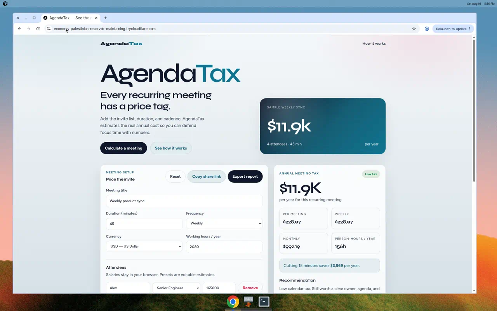

# AgendaTax

**See the real cost of recurring meetings.**

AgendaTax estimates the annual salary cost of a recurring meeting from attendee compensation, duration, and frequency — so teams can make calendar decisions with numbers, not vibes.



## Problem Solved

Recurring meetings quietly consume engineering and product capacity. A “quick” 45-minute weekly sync with four mid-level employees can cost tens of thousands of dollars per year. AgendaTax makes that tax visible before you accept the invite.

## Features

- Salary-weighted cost estimates (per meeting, weekly, monthly, yearly)
- Role presets with editable custom salaries
- Multi-currency formatting (USD, EUR, GBP, INR, CAD, AUD)
- Severity levels with actionable recommendations
- “Cut 15 minutes” savings callout
- Privacy-first localStorage persistence
- Shareable URL hash scenarios (no server storage)
- Markdown report export via API
- Loading, empty, and error states
- Accessible labels, keyboard focus, skip link, reduced-motion support
- SEO metadata, robots.txt, and sitemap

## Tech Stack

- **Frontend:** Next.js 16, React 19, TypeScript, Tailwind CSS 4
- **Backend:** Next.js Route Handler (`POST /api/report`)
- **Persistence:** Browser `localStorage` + URL hash sharing
- **Fonts:** Syne + Figtree

## Installation

```bash
cd agendatax
cp .env.example .env.local
npm install
npm run dev
```

Open [http://localhost:3000](http://localhost:3000).

### Scripts

| Command | Description |
| --- | --- |
| `npm run dev` | Start local development server |
| `npm run build` | Production build |
| `npm run start` | Start production server |
| `npm run lint` | Run ESLint |
| `npm run verify` | Run cost-engine sanity checks |

## Environment Variables

| Variable | Description |
| --- | --- |
| `NEXT_PUBLIC_APP_URL` | Canonical site URL for SEO metadata |

See `.env.example`.

## Deployment URL

Live: [https://economy-palestinian-reservoir-maintaining.trycloudflare.com](https://economy-palestinian-reservoir-maintaining.trycloudflare.com)

Static artifacts are published to the [`gh-pages`](https://github.com/sudhev1881-eng/daily-builds/tree/gh-pages) branch. Once GitHub Pages is enabled for that branch, the durable project URL will be:

[https://sudhev1881-eng.github.io/daily-builds/](https://sudhev1881-eng.github.io/daily-builds/)

Repository: [https://github.com/sudhev1881-eng/daily-builds](https://github.com/sudhev1881-eng/daily-builds)

CI: `.github/workflows/deploy-agendatax.yml`

## Project Structure

```
agendatax/
├── src/
│   ├── app/                 # App Router pages, SEO, API
│   ├── components/          # UI (calculator, attendees, results)
│   └── lib/                 # Cost engine, presets, share, storage
├── scripts/                 # Verification helpers
├── docs/                    # Screenshots
├── .env.example
├── LICENSE
└── README.md
```

## Future Improvements

- Team salary bands imported from CSV (still client-side)
- Meeting portfolio view (multiple recurring meetings at once)
- ICS / Google Calendar event import
- Org-level benchmarks (anonymous aggregates)
- Dark theme toggle respecting system preference
- PWA offline install

## License

MIT — see [LICENSE](./LICENSE).
